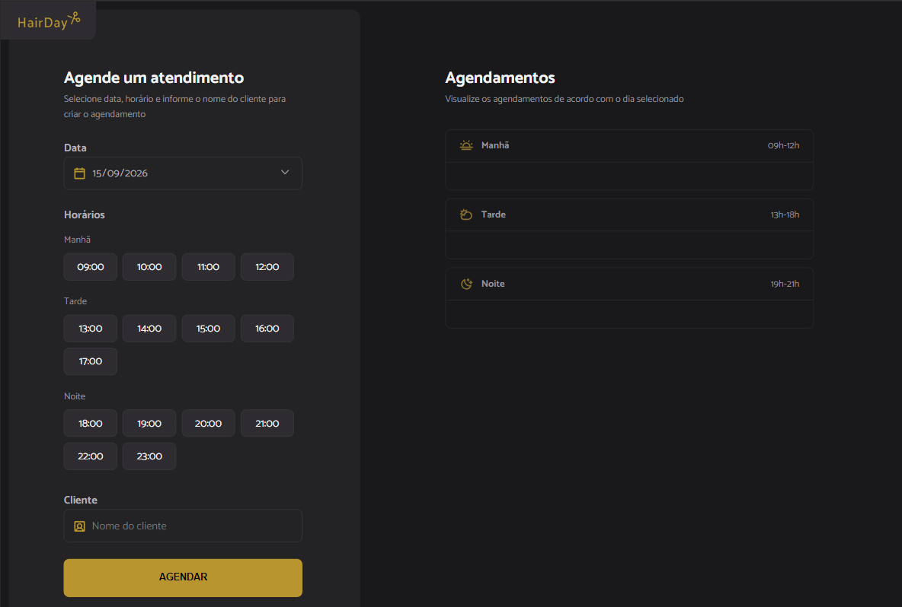

# Hairday - Plataforma de Agendamento

Simulador agendamento para salão de cabelelerio.
O site permite agendar horários nos periodos da manhã, tarde e noite, em horários prédefinidos em uma arquivo json.
Possui validação para:

- Mostrar e impedir agendar horários já marcados
- Impedi agendamento em datas e hora passadas.



## Tecnologias

### Frontend

- HTML5
- CSS3
- JavaScript (ES6 Modules)

### Dependências (npm)

- **dayjs** `^1.11.23` - Manipulação de datas
- **json-server** `^0.17.4` - Servidor mock para API

### Desenvolvimento

- **Webpack** `^5.110.3` - Bundler
- **Babel** `^8.0.5` - Transpilador JavaScript
- **webpack-dev-server** `^6.0.0` - Dev server
- **Loaders**: babel-loader, css-loader, style-loader
- **Plugins**: html-webpack-plugin, copy-webpack-plugin

## Instalação

### Pré-requisitos

- Node.js (v14 ou superior)
- npm ou yarn

### Passos

1. Clone este repositório:

   ```bash
   git clone https://github.com/guilhermexpc/rocketseat-fs-hairday.git
   ```

   ```bash
   cd rocketseat-fs-hairday
   ```

<details>

<summary> Instalação das dependencias </summary>

```bash
npm install
```

3. Inicie os servidores em dois terminais diferentes:

   **Terminal 1 - Servidor Mock (API):**

   ```bash
   npm run server
   ```

   Roda em `http://localhost:3333`

   **Terminal 2 - Dev Server (Aplicação):**

   ```bash
   npm run dev
   ```

   Arquivo de configuração

   ```
   src/services/api-config.js
   ```

   Schema de Agendamentos (Mock)

   ```
   src/server.json
   ```

   </details>

## Funcionalidades

- Seleção de data via calendário
- Seleção de horários disponíveis
- Visualização dos horários agendados
- Exclusão de agendamentos

## Arquitetura Técnica

### Estrutura do Projeto

```
src/
├── modules/          # Módulos de funcionalidade
│   ├── form/         # Interações de formulário e seleção de horários
│   ├── schedules/    # Exibição e cancelamento de agendamentos
├── services/         # Camada de integração com API
├── utils/            # Funções utilitárias
└── assets/           # Imagens e recursos estáticos
```

### API & Endpoints

A aplicação comunica com um servidor mock (simulado) que expõe os seguintes endpoints:

| Método   | Endpoint         | Descrição                               |
| -------- | ---------------- | --------------------------------------- |
| `GET`    | `/schedules`     | Lista todos os agendamentos registrados |
| `POST`   | `/schedules`     | Cria um novo agendamento                |
| `DELETE` | `/schedules/:id` | Remove um agendamento existente         |

**Base URL**: `http://localhost:3333` (configurado em `src/services/api-config.js`)

### Fluxo de Dados

1. **Carregamento de Horários** (`hoursLoad.js`)
   - Busca agendamentos do dia via `GET /schedules`
   - Filtra dados por data usando Day.js
   - Marca horários indisponíveis (já agendados)

2. **Submissão de Agendamento** (`submit.js`)
   - Valida data, horário e nome
   - Envia `POST /schedules` com dados do agendamento
   - Atualiza a lista em tempo real

3. **Cancelamento** (`cancel.js`)
   - Captura ID do agendamento via `data-id`
   - Envia `DELETE /schedules/:id`
   - Remove da interface após confirmação

```bash

```
